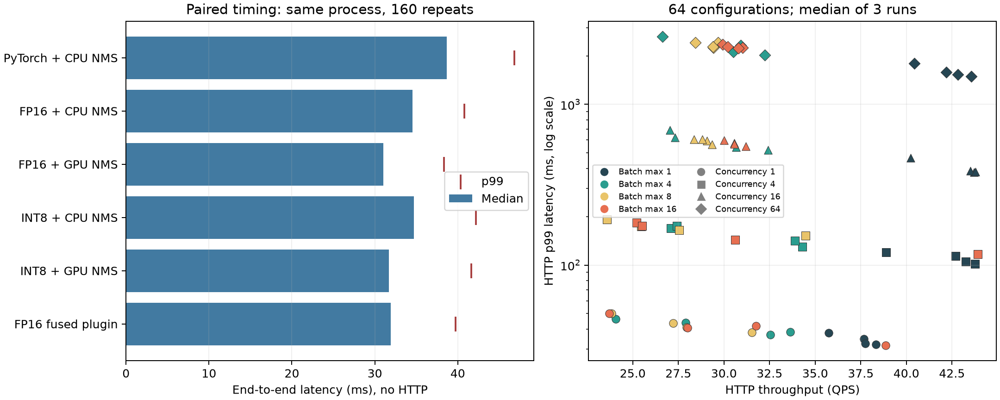

# Day 07 — 端到端服务化与动态批处理

## 1. 实测结论

- 同一进程配对:PyTorch→FP16 引擎段加速 **3.81×**,CPU 后处理链路端到端加速 **1.12×**。
  FP16 最大单段实际为 **preprocess**(15.441 ms)。不能把上一日计数器中的后处理时间
  直接认定为当前 CPU NMS 瓶颈。
- FP16 CPU→GPU 后处理:端到端中位数 **34.538 → 31.037 ms**,速度比 1.113×。
  结果按实测保留,不预设 GPU 必须更快。
- 扫描内最大三次中位吞吐 **43.93 QPS**:batch 上限 16、wait=0 ms、并发 4,p99=117.28 ms。
  它是有限配置网格的观测最大值,不是部署承诺。
- 来源:`results/timing.json`、`results/sweep_summary.json`。Docker 仅交付配方,
  当前机器未构建运行。

## 2. 数据、边界与基线

RTX 4090,torch 2.14.0+cu130,CUDA 13.0,TensorRT 11.3.0.99,ultralytics 8.3.100。
新机重建引擎,不直接沿用旧 GPU plan。模型输出为固定维度的检测张量,固定方形输入,
conf>0.25、类别感知 NMS IoU 0.7、单标签 argmax、max_det 300。
所有版本与 API 见 `results/preflight.json`,构建与哈希见 `results/build.json`。

数据组织方式确认后继续;寻址核验通过(图片、标签、框数、空白标注与上一日一致)。没有改动数据集。
沿用前一日的校准/评测划分;本日做部署数值与耗时检验,没有新选精度阈值,也不宣称独立测试 mAP。
见 `results/data_validation.json`。

保留前一日的纠正:评测图片均为正方形,带灰边的方案是增加边框,不是目标像素放大。
本日只比较 1024 输入。PyTorch 模型在等价简化后 fuse,计时前加载,参数不变。

## 3. 七段配对计时

本实验列出七个实际阶段,全部拆开。每条路线 warmup 24、正式 160 次,固定样本循环,
全部路线同进程交错执行。读图含 `read_bytes` 与解码,操作系统缓存已热。
H2D 使用 pageable CPU tensor;每个 CUDA 边界同步。推理段包含 wrapper 内部 GPU 缓冲复制。
总耗时不包含 HTTP;各段中位数之和不必等于总中位数。

| 路线 | 阶段 | 中位 ms | p99 ms | 标准差 ms |
|------|------|--------:|-------:|----------:|
| pytorch_cpu | decode | 13.321 | 16.917 | 1.604 |
| pytorch_cpu | preprocess | 15.158 | 20.884 | 1.545 |
| pytorch_cpu | h2d | 1.388 | 5.186 | 0.717 |
| pytorch_cpu | inference | 5.601 | 12.655 | 1.258 |
| pytorch_cpu | d2h | 0.483 | 1.198 | 0.200 |
| pytorch_cpu | nms | 2.493 | 3.440 | 0.461 |
| pytorch_cpu | restore | 0.106 | 0.562 | 0.085 |
| pytorch_cpu | **e2e** | **38.650** | 46.841 | 2.890 |
| pytorch_gpu | decode | 12.651 | 16.670 | 1.557 |
| pytorch_gpu | preprocess | 14.686 | 21.433 | 1.441 |
| pytorch_gpu | h2d | 1.380 | 4.373 | 0.516 |
| pytorch_gpu | inference | 5.456 | 11.936 | 1.236 |
| pytorch_gpu | d2h | 0.032 | 0.065 | 0.009 |
| pytorch_gpu | nms | 0.870 | 1.676 | 0.235 |
| pytorch_gpu | restore | 0.127 | 0.331 | 0.056 |
| pytorch_gpu | e2e | 35.408 | 43.191 | 2.596 |
| fp16_cpu | decode | 13.284 | 16.992 | 1.527 |
| fp16_cpu | preprocess | **15.441** | 21.472 | 1.684 |
| fp16_cpu | h2d | 1.393 | 3.139 | 0.385 |
| fp16_cpu | inference | **1.471** | 5.027 | 0.602 |
| fp16_cpu | d2h | 0.490 | 0.906 | 0.159 |
| fp16_cpu | nms | 2.279 | 3.109 | 0.447 |
| fp16_cpu | restore | 0.105 | 0.546 | 0.083 |
| fp16_cpu | **e2e** | **34.538** | 40.779 | 2.514 |
| fp16_gpu | decode | 12.654 | 16.159 | 1.535 |
| fp16_gpu | preprocess | 14.496 | 20.270 | 1.459 |
| fp16_gpu | h2d | 1.385 | 2.978 | 0.338 |
| fp16_gpu | inference | 1.452 | 4.194 | 0.496 |
| fp16_gpu | d2h | 0.031 | 0.044 | 0.007 |
| fp16_gpu | nms | 0.980 | 1.264 | 0.160 |
| fp16_gpu | restore | 0.127 | 0.162 | 0.021 |
| fp16_gpu | e2e | **31.037** | 38.315 | 2.557 |
| int8_cpu | decode | 13.210 | 16.501 | 1.545 |
| int8_cpu | preprocess | 15.164 | 21.212 | 1.683 |
| int8_cpu | h2d | 1.383 | 2.428 | 0.189 |
| int8_cpu | inference | 2.168 | 5.512 | 0.563 |
| int8_cpu | d2h | 0.493 | 0.972 | 0.132 |
| int8_cpu | nms | 2.247 | 3.329 | 0.438 |
| int8_cpu | restore | 0.105 | 0.456 | 0.069 |
| int8_cpu | e2e | 34.713 | 42.163 | 2.582 |
| int8_gpu | decode | 12.649 | 16.737 | 1.561 |
| int8_gpu | preprocess | 14.419 | 21.153 | 1.755 |
| int8_gpu | h2d | 1.381 | 2.517 | 0.242 |
| int8_gpu | inference | 2.153 | 3.523 | 0.309 |
| int8_gpu | d2h | 0.032 | 0.050 | 0.014 |
| int8_gpu | nms | 0.982 | 2.341 | 0.303 |
| int8_gpu | restore | 0.127 | 0.387 | 0.049 |
| int8_gpu | e2e | 31.715 | 41.658 | 2.876 |
| plugin_plugin | decode | 13.187 | 17.727 | 1.672 |
| plugin_plugin | preprocess | 15.247 | 22.289 | 1.729 |
| plugin_plugin | h2d | 1.383 | 3.025 | 0.338 |
| plugin_plugin | inference | 1.564 | 4.516 | 0.479 |
| plugin_plugin | d2h | 0.034 | 0.054 | 0.007 |
| plugin_plugin | nms | 0.174 | 0.263 | 0.027 |
| plugin_plugin | restore | 0.157 | 0.515 | 0.084 |
| plugin_plugin | e2e | 31.936 | 39.729 | 2.699 |

原始逐次计时及统计见 `results/timing.json`。GPU 路线先在 GPU 上筛选置信度再 `batched_nms`,
只拷最终框;CPU 路线拷完整 raw 再筛选。

## 4. NMS 一致性

CPU 基线先与已安装的 ultralytics NMS 在小样本上比较;正式检查覆盖整个评测集。
比较按类别与坐标规范排序,忽略返回排序差异,但精确检查框数、类别、坐标与分数。
不同框数时不强行按索引算坐标误差。

| 路线 | 逐位相同比例 | 框数不同 | 类别/数目不同 | 同数量最大坐标差 px |
|------|-------------:|---------:|--------------:|-------------------:|
| fp16_gpu | 100% | 0 | 0 | 0 |
| fp16_plugin_same_raw | 98.5% | 1 | 1 | 0.8125 |
| fp16_plugin_full_engine | 27.9% | 10 | 10 | 2 |
| int8_gpu | 100% | 0 | 0 | 0 |
| int8_plugin_same_raw | 100% | 0 | 0 | 0 |

EfficientNMS 参数来自真实 registry;图中先按 argmax 屏蔽非最高类别,使其符合单标签 CPU 策略。
插件单独接收同一 raw 的实验分离 NMS 算法差异;完整插件引擎对照还包含重新构建后的浮点差异
(官方插件说明见 NVIDIA TensorRT 仓库)。

FP16 同 raw 插件差异的 12 图都存在同类别、同分数的替换框,支持并列分数保留顺序差异;
没有发现新保留框分数恰好 0.25,不能把本次差异归因于 conf 等号边界。见 `results/plugin_diagnosis.json`。
完整插件引擎还包含 tactic 和融合变化,不能全部归因于 NMS。服务采用与 CPU 完全一致的
torchvision GPU 路线。插件计时中 inference 已含内置 NMS,nms 列仅是取回数量和整理最终结果的
包装成本,不能把这一列当插件内核耗时。

## 5. HTTP 服务与动态批处理

FastAPI 提供 `POST /predict`、`GET /healthz`、`GET /metrics`;引擎只在启动时加载并 warmup。
单个专用推理线程独占一个 execution context,避免状态竞争;异步接收与有界 FIFO 队列解耦。
先到请求达到 wait 上限或攒够 max_batch 即送 GPU;wait=0 仅取已在队列中的请求。
忙时排队可能超过 wait,wait 不是端到端时延保证。

动态 profile batch min/opt/max=1/4/16,空间维固定;异构图片 batch 1/4/8/16 在本次样本上
与同引擎逐图 batch 1 的 raw 最大差均为 0,见 `results/batch_validation.json`。
与 PyTorch 的对照中,高置信框最大偏差 0.557 输入像素、分数最大偏差 0.00667,少量图片 NMS 框数不同,
见 `results/dynamic_reference.json`。这属于必须保留的 FP16/导出数值差异,**不宣称动态服务相对
PyTorch 无损**。batch 验证只覆盖这些样本,不保证全输入逐位等价。

接口、坐标含义、启动与清理命令见 `scripts/DEPLOY.md`。压测使用 GPU 后处理,
同一服务进程中只由唯一推理线程访问 context;每组配置结束干净退出,记录显存释放。

## 6. 固定 batch 上限 1、wait 0 的并发扫描

| 并发 | QPS | p50 ms | p95 ms | p99 ms | GPU 平均利用率 % | 峰值 MiB |
|-----:|----:|-------:|-------:|-------:|----------------:|---------:|
| 1 | 37.68 | 26.21 | 30.99 | 34.81 | 7.6 | 2207 |
| 4 | 42.70 | 91.81 | 108.16 | 113.61 | 8.8 | 2207 |
| 16 | 43.72 | 364.93 | 374.60 | 377.70 | 9.3 | 2207 |
| 64 | 43.56 | 1460.30 | 1483.74 | 1492.50 | 9.0 | 2207 |

每点 320 请求、32 warmup、seed 42,三次重复各项取中位数;不选最好一次。
闭环并发压测,没有模拟泊松到达或开放环 SLA。最多 4 个客户端进程;空回声服务读取同样请求体,
先测其容量,再核验高于模型服务,见 `results/client_capacity.json`。

## 7. 动态批处理完整网格

| batch 上限 | wait ms | 并发 | QPS | p99 ms | QPS CV % | GPU 利用率 % | 峰值 MiB |
|-----------:|--------:|-----:|----:|-------:|---------:|-------------:|---------:|
| 1 | 0 | 1 | 37.68 | 34.81 | 3.88 | 7.6 | 2207 |
| 1 | 0 | 4 | 42.70 | 113.61 | 1.05 | 8.8 | 2207 |
| 1 | 0 | 16 | 43.72 | 377.70 | 0.15 | 9.3 | 2207 |
| 1 | 0 | 64 | 43.56 | 1492.50 | 2.74 | 9.0 | 2207 |
| 1 | 2 | 1 | 37.74 | 32.51 | 1.29 | 7.7 | 2207 |
| 1 | 2 | 4 | 43.25 | 105.44 | 0.93 | 8.7 | 2207 |
| 1 | 2 | 16 | 40.24 | 464.08 | 2.55 | 8.0 | 2207 |
| 1 | 2 | 64 | 40.43 | 1798.95 | 2.52 | 8.3 | 2207 |
| 1 | 5 | 1 | 38.33 | 32.06 | 3.15 | 7.8 | 2207 |
| 1 | 5 | 4 | 43.76 | 101.99 | 1.10 | 8.9 | 2207 |
| 1 | 5 | 16 | 43.51 | 387.11 | 1.10 | 8.7 | 2207 |
| 1 | 5 | 64 | 42.19 | 1586.83 | 0.60 | 8.7 | 2207 |
| 1 | 10 | 1 | 35.75 | 37.89 | 2.28 | 7.2 | 2207 |
| 1 | 10 | 4 | 38.88 | 120.37 | 4.28 | 7.8 | 2207 |
| 1 | 10 | 16 | 43.78 | 381.67 | 0.22 | 9.1 | 2207 |
| 1 | 10 | 64 | 42.83 | 1533.43 | 0.92 | 8.8 | 2207 |
| 4 | 0 | 1 | 33.63 | 38.43 | 4.29 | 7.1 | 2271 |
| 4 | 0 | 4 | 34.28 | 129.90 | 0.78 | 5.7 | 2319 |
| 4 | 0 | 16 | 32.41 | 520.88 | 0.97 | 4.9 | 2367 |
| 4 | 0 | 64 | 32.24 | 2030.67 | 3.02 | 5.0 | 2367 |
| 4 | 2 | 1 | 32.55 | 36.91 | 6.54 | 6.9 | 2271 |
| 4 | 2 | 4 | 33.88 | 141.56 | 15.07 | 5.1 | 2367 |
| 4 | 2 | 16 | 30.68 | 539.91 | 0.79 | 5.0 | 2367 |
| 4 | 2 | 64 | 30.52 | 2120.30 | 2.42 | 4.4 | 2367 |
| 4 | 5 | 1 | 27.91 | 43.76 | 1.65 | 5.7 | 2271 |
| 4 | 5 | 4 | 27.08 | 169.26 | 1.42 | 3.7 | 2319 |
| 4 | 5 | 16 | 27.31 | 623.70 | 0.54 | 4.8 | 2319 |
| 4 | 5 | 64 | 30.91 | 2326.26 | 6.82 | 3.6 | 2367 |
| 4 | 10 | 1 | 24.06 | 46.16 | 0.72 | 5.0 | 2271 |
| 4 | 10 | 4 | 27.41 | 175.42 | 3.11 | 4.1 | 2319 |
| 4 | 10 | 16 | 27.05 | 692.11 | 2.01 | 4.6 | 2319 |
| 4 | 10 | 64 | 26.62 | 2645.71 | 7.13 | 4.2 | 2319 |
| 8 | 0 | 1 | 27.20 | 43.41 | 0.36 | 5.3 | 2377 |
| 8 | 0 | 4 | 27.54 | 164.63 | 1.86 | 4.6 | 2377 |
| 8 | 0 | 16 | 29.06 | 595.63 | 0.13 | 5.1 | 2557 |
| 8 | 0 | 64 | 29.69 | 2425.41 | 1.80 | 5.6 | 2557 |
| 8 | 2 | 1 | 31.52 | 38.06 | 1.43 | 6.3 | 2377 |
| 8 | 2 | 4 | 34.48 | 152.59 | 13.69 | 4.4 | 2377 |
| 8 | 2 | 16 | 28.81 | 605.29 | 0.53 | 4.6 | 2557 |
| 8 | 2 | 64 | 29.41 | 2252.10 | 2.57 | 5.0 | 2557 |
| 8 | 5 | 1 | 27.96 | 41.05 | 2.02 | 5.8 | 2377 |
| 8 | 5 | 4 | 25.47 | 174.22 | 1.53 | 3.9 | 2377 |
| 8 | 5 | 16 | 28.37 | 607.49 | 0.46 | 5.6 | 2569 |
| 8 | 5 | 64 | 29.39 | 2286.53 | 1.29 | 4.9 | 2569 |
| 8 | 10 | 1 | 23.83 | 49.97 | 1.37 | 4.8 | 2377 |
| 8 | 10 | 4 | 23.60 | 191.74 | 3.17 | 3.4 | 2377 |
| 8 | 10 | 16 | 29.34 | 564.77 | 0.23 | 6.1 | 2569 |
| 8 | 10 | 64 | 28.44 | 2429.86 | 1.42 | 4.4 | 2569 |
| 16 | 0 | 1 | 38.85 | 31.71 | 0.58 | 7.9 | 2591 |
| 16 | 0 | 4 | **43.93** | 117.28 | 1.85 | 6.6 | 2591 |
| 16 | 0 | 16 | 30.00 | 597.07 | 3.80 | 2.1 | 2785 |
| 16 | 0 | 64 | 29.93 | 2367.05 | 2.18 | 5.8 | 2977 |
| 16 | 2 | 1 | 31.75 | 41.80 | 2.72 | 6.5 | 2591 |
| 16 | 2 | 4 | 30.61 | 143.69 | 19.20 | 5.9 | 2591 |
| 16 | 2 | 16 | 31.20 | 550.04 | 1.15 | 6.2 | 2735 |
| 16 | 2 | 64 | 31.01 | 2247.58 | 1.42 | 9.0 | 2927 |
| 16 | 5 | 1 | 27.99 | 40.78 | 0.26 | 5.5 | 2591 |
| 16 | 5 | 4 | 25.21 | 183.16 | 2.16 | 4.4 | 2591 |
| 16 | 5 | 16 | 30.57 | 573.38 | 2.52 | 4.8 | 2783 |
| 16 | 5 | 64 | 30.79 | 2246.03 | 1.47 | 12.4 | 2951 |
| 16 | 10 | 1 | 23.71 | 49.98 | 1.64 | 4.9 | 2591 |
| 16 | 10 | 4 | 25.51 | 174.76 | 5.39 | 4.4 | 2591 |
| 16 | 10 | 16 | 30.56 | 568.78 | 0.53 | 6.4 | 2783 |
| 16 | 10 | 64 | 30.22 | 2289.90 | 1.53 | 4.9 | 2975 |

最终 192 次运行在同一 GPU 会话内依次完成,配置顺序 seed 42 打乱。旧轮中断于 84 次,
保留在 `results/attempt1_interrupted`,未并入最终表。七段配对计时来自独立完整进程,
最终 HTTP 扫描来自另一天;不在两轮之间计算延迟加速比。GPU 每 100 ms 后台采样;
负载较短,采样峰值不是连续精确峰值。三次 QPS 的总体标准差/均值作为各点 CV,
按并发区间汇总噪声范围,不把细小差别自动解释为收益。
见 `results/noise_floor.json`、`results/sweep_summary.json`。

## 8. 与 LLM 批处理的对照

视觉检测的规范化输入长度固定,每批一次前向即可结束;攒批主要交换启动/并行效率与等待时间。
LLM 解码是变长、自回归多步,短请求无需等待长请求全部 token 完成,连续批处理还可在迭代之间
回收位置并接入新请求。视觉批处理没有对应的 token 级调度机会,不能把 LLM 侧的倍数直接套用。

LLM 侧记录:定长负载下 vLLM 相对静态 HF 吞吐 3.82/3.27 req/s,变长 3.45/0.94;
32-token 请求延迟中位 0.6/92.6 s。该静态对照采用实测批耗时加离散事件时钟,vLLM 走 HTTP,
且后端实现不同,所以这些数字是该实验配置的对照,不是纯调度算法的隔离测量。
原始引用与报告哈希保存在 `results/prior_facts.json`。

## 9. 预测修正、限制与交付

原预测 NMS 为最大单段;实测 FP16 CPU 链路最大项为 preprocess。**真实分段数据优先于开工前的假设。**
GPU 后处理能否改善端到端按第 1/3 节结果判断;不同 CPU 线程数、图像大小和候选数量下不保证相同排序。

所有失败和预检停止原样保留在 `journal.md`;预测不事后修改。新依赖仅装入实验目录;
没有升级 ultralytics。Dockerfile 与 compose 提供配方,但当前机器无 Docker,未验证构建/运行。
镜像内 TRT 版本不同,须在部署镜像和目标 GPU 上重建引擎。

本日没有完整重新测 mAP、互联网网络性能、长稳压测或部署 SLA。数值对齐不能代替这些验证。
计时路线虽在同进程交错执行,但顺序固定,GPU 路线的解码/预处理也与 CPU 路线有差异;
不能把全部端到端差值都归因于 NMS。各段同步计时代表串行请求成本,不是重叠流水线的理论最小值。
服务 `queue_ms` 实际为到该请求开始 CPU 预处理的等待,包含同批前面图片的 CPU 处理;
`h2d_batch_ms` 包含 `np.stack`。CPU 资源与 cgroup 配额见 `results/host_environment.json`。

## 10. 当前服务的配置取舍

batch 上限 1、wait 0、并发 4 得到 42.70 QPS、p99 113.61 ms;网格最高点只高 2.86%,
其三次重复峰谷差为 4.39%,不足以仅凭该差值宣称大 batch 稳定更优。
**强调最高点会掩盖 CPU 解码/预处理仍是主成本。**

低延迟取舍:batch 1、wait 0、并发 1 为 37.68 QPS、p99 34.81 ms。同样 batch 1/wait 0
从并发 16 升至 64,吞吐 43.72→43.56 QPS 基本不变,p99 377.70→1492.50 ms,主要代价是排队。
以上是本实现与该负载的取舍,不是所有检测服务的通用最优参数。全部数字见 `results/sweep_summary.json`。